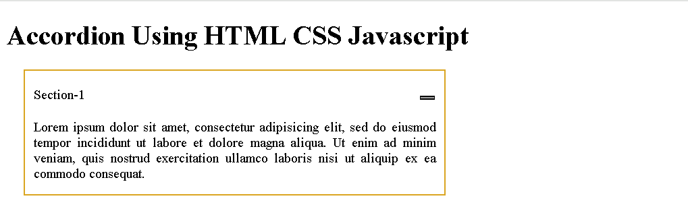

# Accordion Using HTML, CSS, and JavaScript

This project demonstrates how to build a simple accordion-style component using HTML, CSS, and JavaScript. The accordion allows sections to expand and collapse when clicked, providing an interactive UI element for organizing content.

## Project Overview

The accordion consists of multiple sections, each with a header and content. The header (`div.top`) is clickable, and when clicked, it toggles the visibility of the associated content (`p.data`). Each section can be independently expanded or collapsed.

### Key Features:
- **Toggle Visibility**: Clicking on a section header reveals or hides the corresponding content.
- **CSS Styling**: Basic styling is applied to create the accordion effect, with hidden content and smooth transitions.
- **JavaScript Interaction**: JavaScript is used to toggle the `Accactive` class for each section and the `active` class for the header, handling the visibility and appearance of each section dynamically.

## How It Works

- **HTML**: The HTML defines the structure of the accordion, with each section containing a `div.top` header and a `p.data` content paragraph.
  
- **CSS**: In the CSS file, styles are applied to hide content initially using `display: none`. When a section is clicked, the content becomes visible by toggling the `Accactive` class.
  
- **JavaScript**: 
  - Each `div.top` element has an event listener attached that toggles the `Accactive` class on the corresponding `p.data` element, showing or hiding the content.
  - Another event listener is attached to the section headers to toggle the `active` class, changing the appearance of the section headers when clicked.

## Files

- `index.html`: Contains the HTML structure of the accordion, including the section headers and content.
- `index.css`: Styles for the accordion, including visibility control and transitions.
- `index.js`: JavaScript logic for toggling the active states of the accordion sections and headers.

## How to Use

1. Clone the repository or download the project files.
2. Open `index.html` in your browser to see the accordion in action.
3. Click on the headers (`div.top`) to toggle the visibility of the content (`p.data`).

## Customization

- **Adding Sections**: To add more sections to the accordion, simply copy the structure of an existing section and modify the text content.
- **Styling**: You can easily modify the CSS in `index.css` to change the appearance of the accordion, such as colors, fonts, or animation effects.
